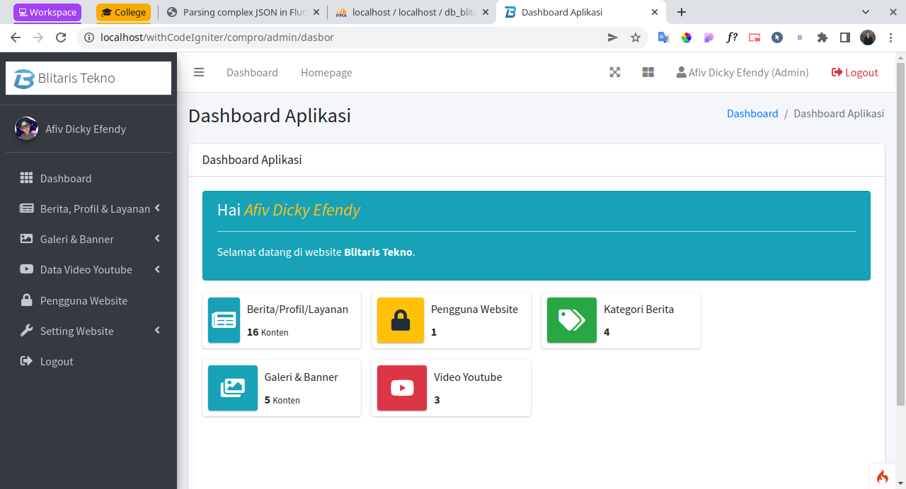
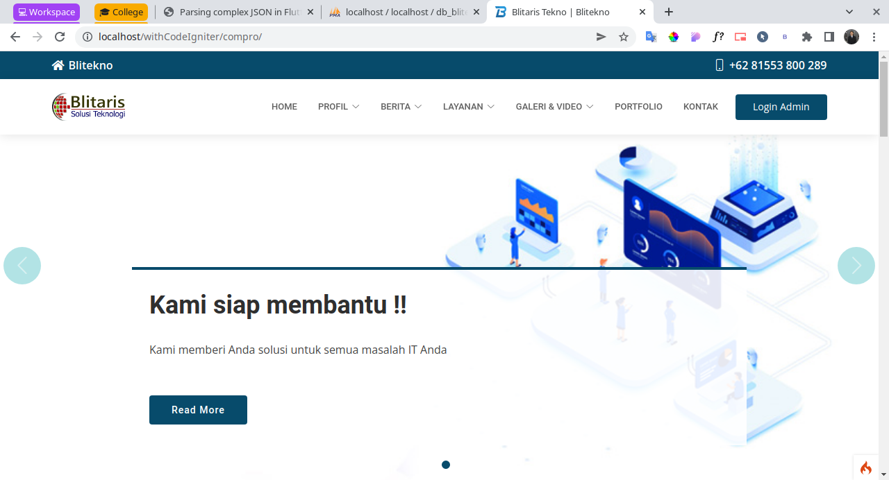
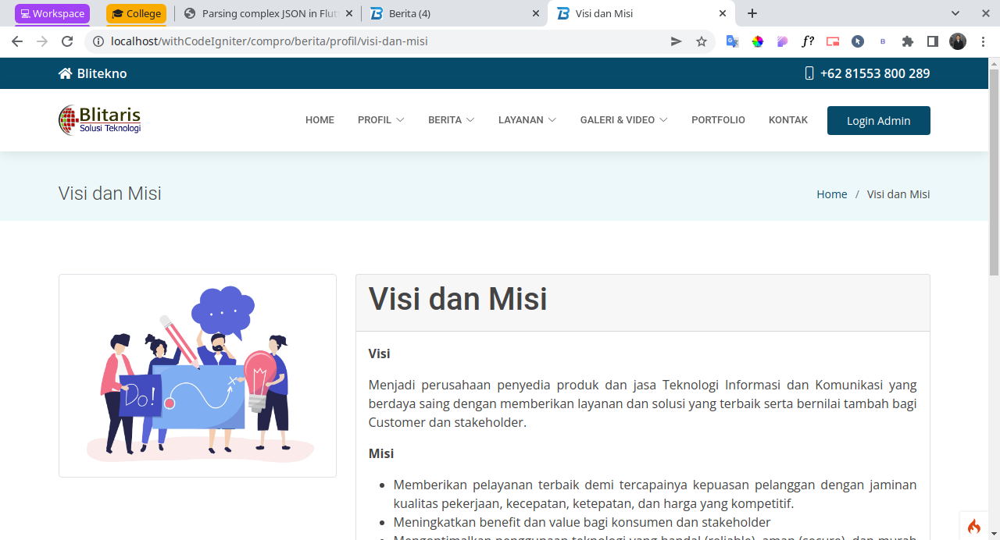
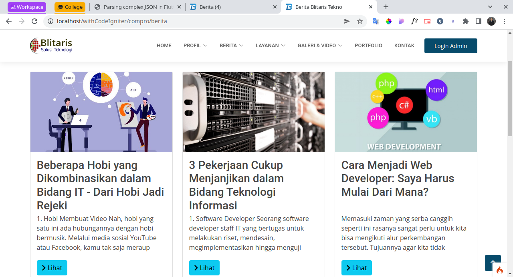
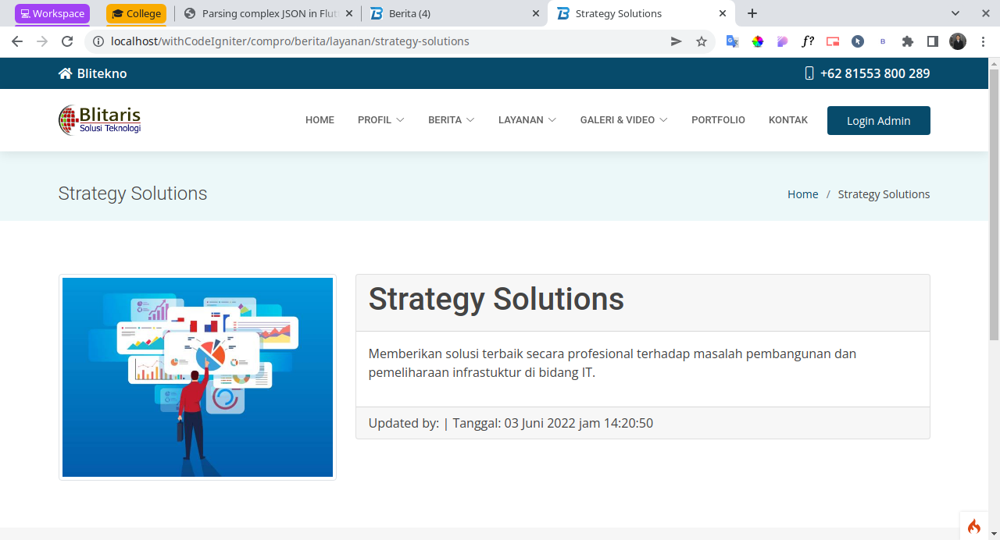
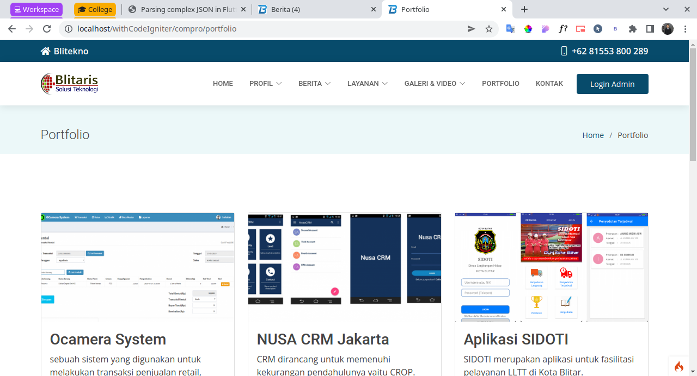

# Company Profile Website Full Features with CodeIgniter 4 Framework

Website ini digunakan untuk laporan akhir pkl saya yaitu membuat website company profile

## Dashboard

## Halaman Utama

## Profile

## Berita

## Layanan

## Portfolio

Dan Lainnya...

## Server Requirements

PHP version 7.3 or higher is required, with the following extensions installed:

- [intl](http://php.net/manual/en/intl.requirements.php)
- [libcurl](http://php.net/manual/en/curl.requirements.php)
